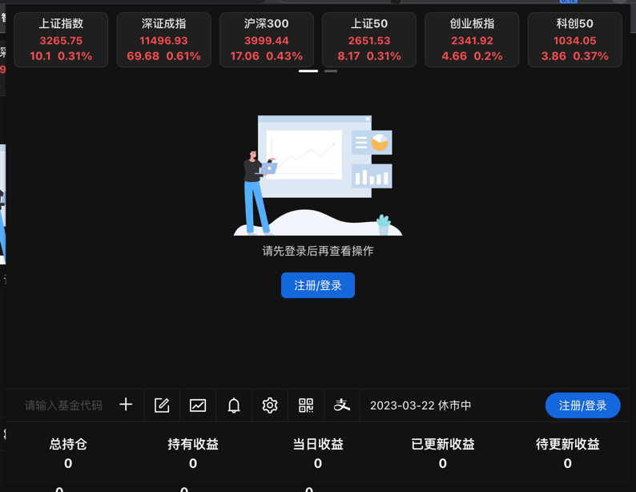
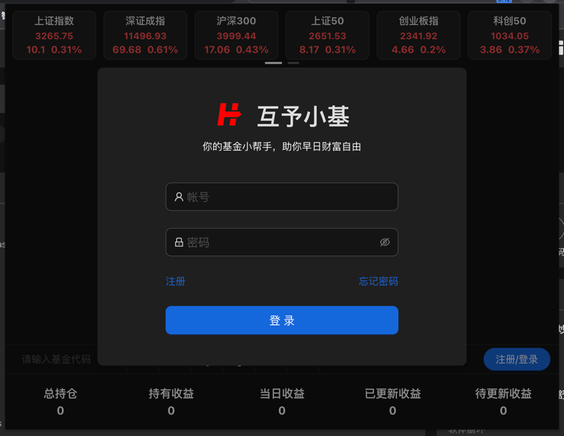
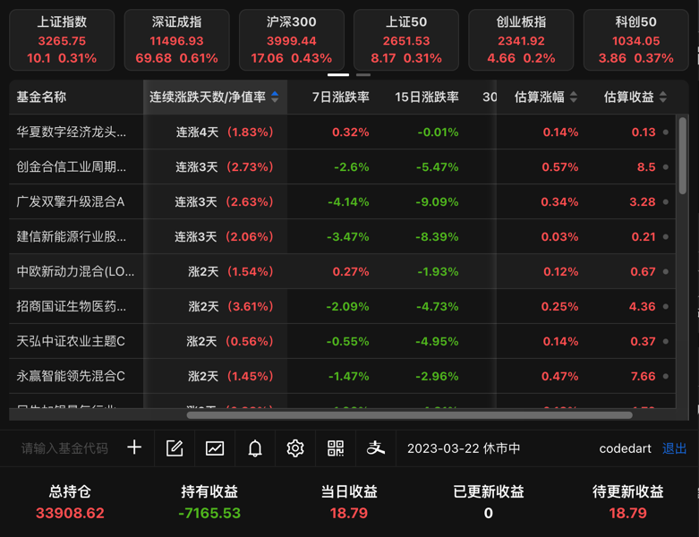

# huyu_fund_browser_expansion 互予小基

互予小基一个chrome浏览器基金扩展插件

#### 目前还在开发中。示发布到市场当中去，取下代码解压后。通过扩展程序加载已解压的扩展程序！本插件为了跑一些数据，要在后端做数据处理，暂不支持匿名添加基金。如果你对本插件感兴趣，可以注册后再添加基金。

## Feature
* 🚄 
* ✅ 
* 🤗 
* 💪 
* 💖 
* ☁️ 

## 截图展示

