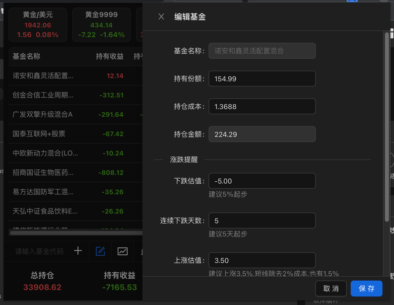

# huyu_fund_browser_expansion 互予小基

互予小基一个chrome浏览器基金扩展插件

#### 目前还在开发中。未发布到应用市场当中去，取下代码解压后移出huyu_fund目录，通过扩展程序加载已解压的扩展程序！本插件为了跑一些数据需要在后端做数据处理，暂不支持匿名添加基金。如果你对本插件感兴趣，可以注册后再添加基金。

## Step
* 下载代码移出huyu_fund目录到任意地方
* ```chrome://extensions/``` 浏览器中输入前面地址进入应用市场。
* 点击加载已解压扩展程序 
* 如果未有加载已解压扩展程序，在扩展中心右上角点击开发者模式。

## Feature
* 🚄 
* ✅ 
* 🤗 
* 💪 
* 💖 
* ☁️ 

## 截图展示





